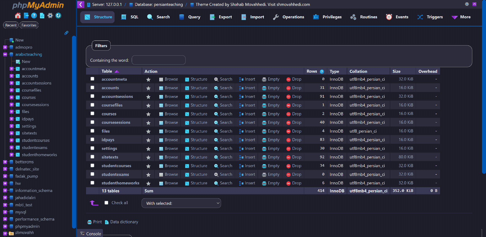

# Blueberry phpMyAdmin Theme

[Blueberry](https://github.com/movahhedi/blueberry-pma-theme) is a modern dark theme for phpMyAdmin, based on "pmahomme" theme (The default theme in phpMyAdmin).

Developed by **Shahab Movahhedi**
- Site: [shmovahhedi.com](https://shmovahhedi.com)
- Email: [dev@shmovahhedi.com](mailto:dev@shmovahhedi.com)
- GitHub: [@movahhedi](https://github.com/movahhedi)

### Development and Copyrights

To build it for development, you need these:
- [NPM](https://www.npmjs.com/)
- [SASS](https://sass-lang.com/install)
- [Bootstrap 5.2.2](https://www.npmjs.com/package/bootstrap/v/5.2.2)

The icons used in Blueberry is from [Fluency (Fluent UI) icon set](https://github.com/microsoft/fluentui-system-icons) by Microsoft (Thanks to [Icons8](https://icons8.com/)).

My custom [jQuery UI v1.13.1](http://jqueryui.com) CSS is also used. Check it out [here](http://jqueryui.com/themeroller/?scope=&folderName=smoothness&bgImgOpacityError=30&bgImgOpacityHighlight=30&bgImgOpacityActive=40&bgImgOpacityHover=40&bgImgOpacityDefault=20&bgImgOpacityContent=20&bgImgOpacityHeader=15&cornerRadiusShadow=8px&offsetLeftShadow=-2px&offsetTopShadow=-2px&thicknessShadow=2px&opacityShadow=30&bgImgOpacityShadow=0&bgTextureShadow=flat&bgColorShadow=%233a3a56&opacityOverlay=30&bgImgOpacityOverlay=50&bgTextureOverlay=flat&bgColorOverlay=%235b5b5b&iconColorError=%23ffffff&fcError=%23ffffff&borderColorError=%23ca0b0b&bgTextureError=flat&bgColorError=%23ca0b0b&iconColorHighlight=%23ffffff&fcHighlight=%23ffffff&borderColorHighlight=%230072e6&bgTextureHighlight=flat&bgColorHighlight=%230072e6&iconColorActive=%2338bdf8&fcActive=%2338bdf8&borderColorActive=%23096ac8&bgTextureActive=flat&bgColorActive=%231e1e2a&iconColorHover=%2338bdf8&fcHover=%2338bdf8&borderColorHover=%23222222&bgTextureHover=flat&bgColorHover=%232c2c3d&iconColorDefault=%2338bdf8&fcDefault=%23d9d9d9&borderColorDefault=%231e1e2a&bgTextureDefault=flat&bgColorDefault=%232c2c3d&iconColorContent=%2338bdf8&fcContent=%23d9d9d9&borderColorContent=%231e1e2a&bgTextureContent=flat&bgColorContent=%231e1e2a&iconColorHeader=%23e2e8f0&fcHeader=%23e2e8f0&borderColorHeader=%231e1e2a&bgTextureHeader=flat&bgColorHeader=%230072e6&cornerRadius=10px&fwDefault=bold&fsDefault=1em&ffDefault=%22Segoe%20UI%22%2C%20%22Segoe%20Pro%22%2C%20Roboto%2C%20Verdana%2C%20sans-serif).

### Any Ideas?

Tell me your ideas as an Issue at [https://github.com/movahhedi/blueberry-pma-theme/issues](https://github.com/movahhedi/blueberry-pma-theme/issues)

### Screenshots

