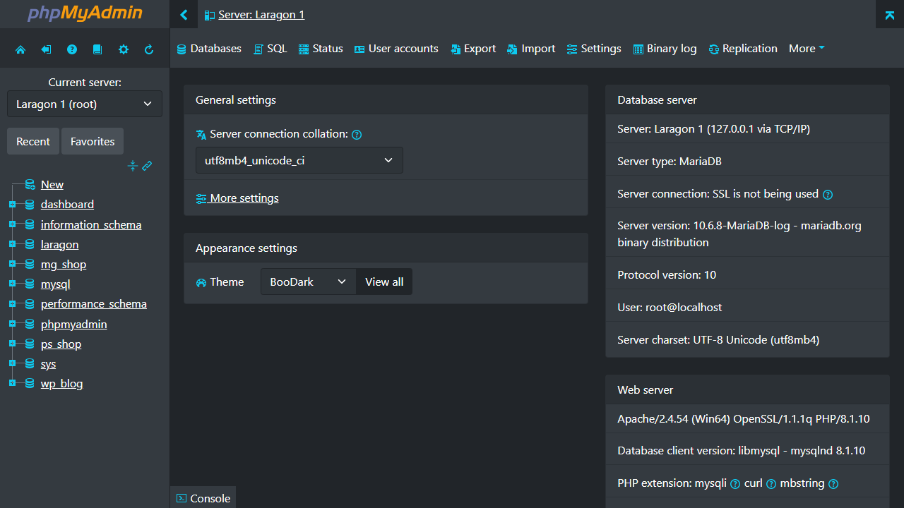

# BooDark v1.1.0



Bootstrap Dark theme for phpMyAdmin

- Supported versions: 5.2
- Bootstrap v5.2.3

## Changes

- Background color changed: shades of gray & black
- Fonts color changed: shades of white & light gray
- Default SQL Query editor color theme changed
- jQuery UI improved: ui-darkness
- Designer adjusted for dark theme
- Console adjusted for dark theme
- Inline SVG using `escape-svg` function
- Color Schemes: `cyan` (main), `teal`, `nord` and `orange`

## Color Schemes

BooDark has several color schemes: `cyan` (main), `teal`, `nord` and `orange`.  
**There is currently no way to change the color scheme in GUI.**

**How to change color scheme?**

Option 1. Edit `scss/_variables.scss`

```scss
// Theme color scheme
// Values: "cyan", "teal", "nord", "orange"
// Default: "cyan"
// Set this value for the desired color scheme

// --- Change cyan
$color-scheme: cyan !default;

// --- to nord
$color-scheme: nord !default;

// --- then run `yarn run build`
```

Option 2. Replace the CSS files. For example:

```sh
mv css/theme.css css/theme-cyan.css
mv css/theme-nord.css css/theme.css
```

## Bugs and feature requests

Have a bug or a feature request? Please search for existing and closed issues.
If your problem or idea is not addressed yet, [please open a new issue](https://github.com/adorade/boodark/issues/new).

## License

BooDark Theme is licensed under MIT.  
Copyright (c) 2022-23 [Adorade](https://github.com/adorade)

## Thanks for use

Hopefully, this theme is useful to you.
