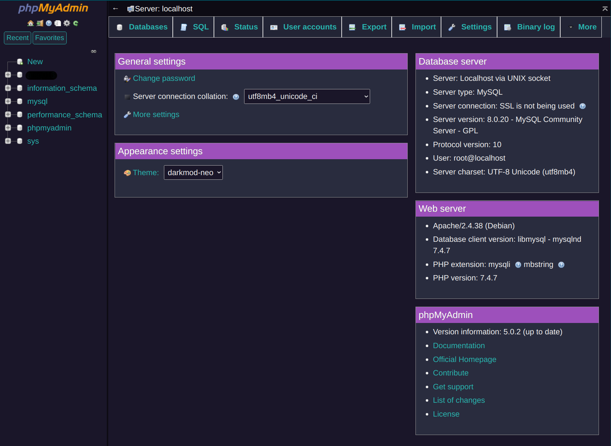
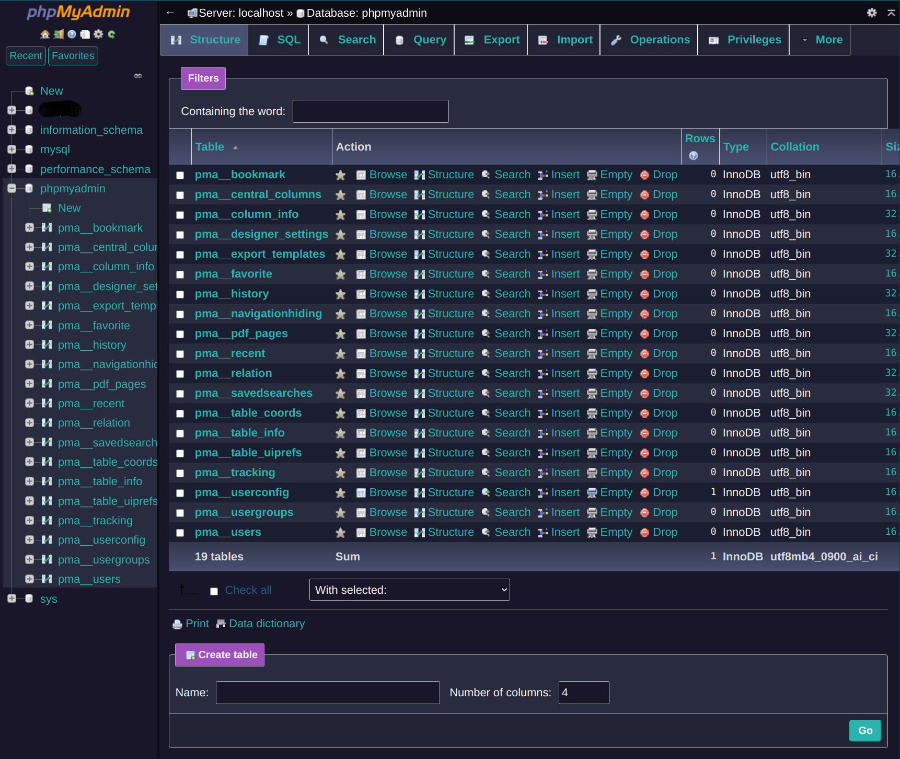
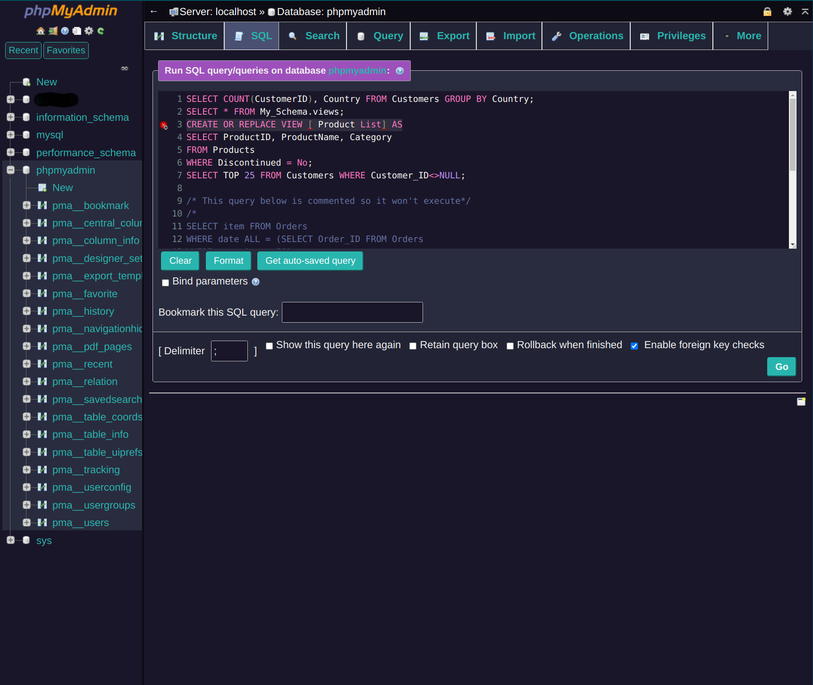

# DarkMod Neo (phpMyAdmin Theme)

A Dark Neon theme based on pmahomme

## How to Install

* Download DarkMod Neo with other themes from https://github.com/phpmyadmin/themes (hopefully added to https://www.phpmyadmin.net/themes/ soon)
* Unzip
* Find "darkmod-neo"
* Move to your phpMyAdmin themes directory.
* Select "darkmod-neo" from the dropdown on phpMyAdmin dashboard.

## Version

[DarkMod Neo 0.1] for phpMyAdmin **5.0**

## Screenshots

## LICENSE

Licensed as GPL.
(comments and contributions appreciated)
