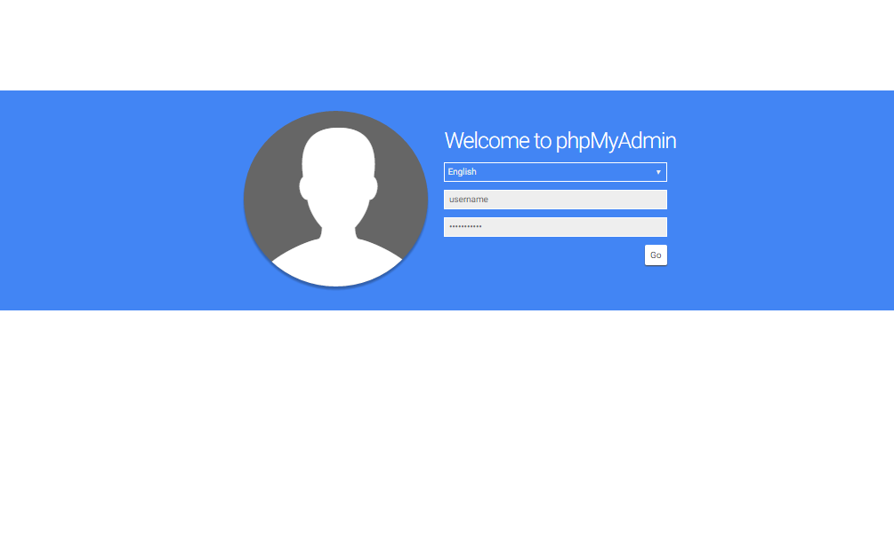
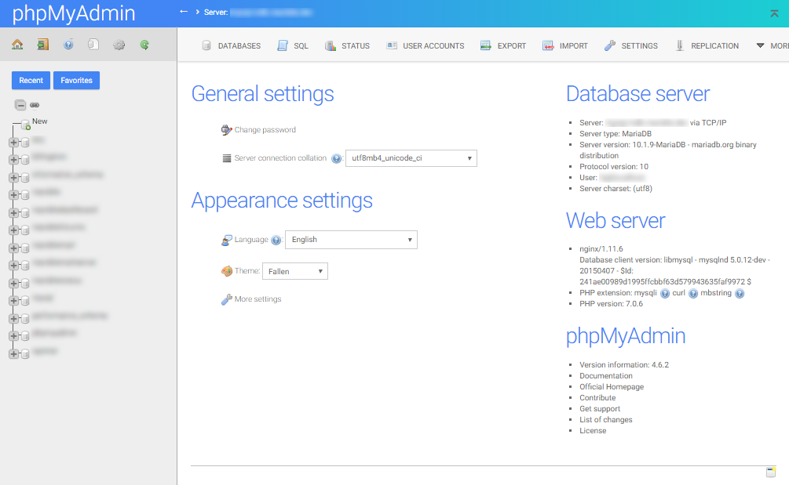
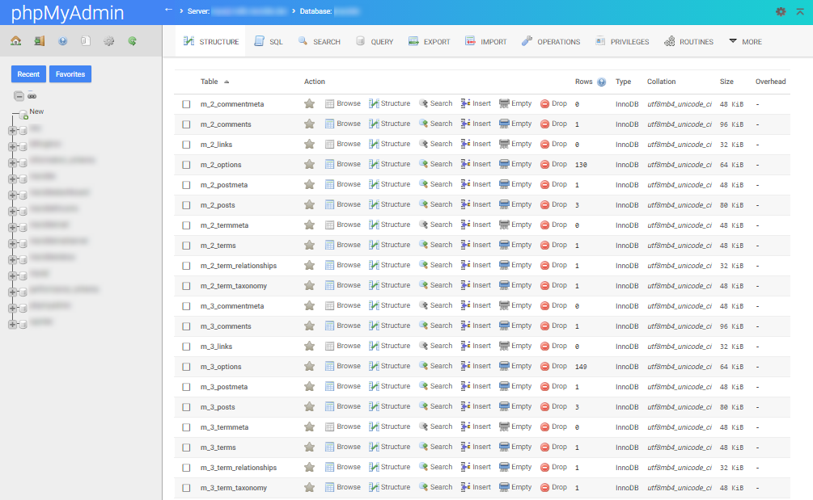

# Fallen (phpMyAdmin Theme)

A Beautiful phpMyAdmin theme. Designed for you.

## Usage

* Download Fallen.
* Unzip **fallen-master**.
* Rename **fallen-master** to **fallen**.
* Move to your phpMyAdmin themes directory.
* Activate "Fallen" from phpMyAdmin dashboard.
* Done.

## Version

[Fallen 0.3](https://files.phpmyadmin.net/themes/fallen/0.3/fallen-0.3.zip) for phpMyAdmin **4.6**

[Fallen 0.4](https://files.phpmyadmin.net/themes/fallen/0.3/fallen-0.4.zip) for phpMyAdmin **4.7**

[Fallen 0.7](https://files.phpmyadmin.net/themes/fallen/0.3/fallen-0.7.zip) for phpMyAdmin **4.8**

> See all version in [phpMyAdmin Themes directory](https://www.phpmyadmin.net/themes/).

## Screenshot

## LICENSE

Licensed under GPL license. Please see the license file: https://github.com/fransallen/fallen/LICENSE
